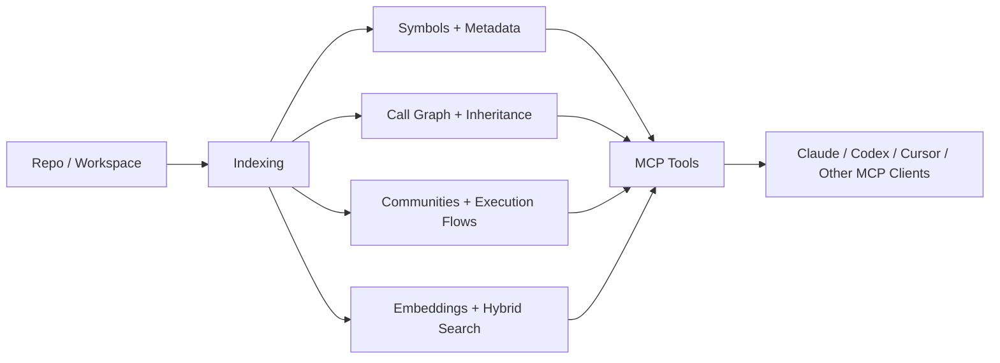

<!-- mcp-name: io.github.srclight/srclight -->

# Srclight

**AI-first code intelligence for fullstack repos.**

Srclight is a heavily upgraded fork of the original `srclight`, rebuilt for the codebases AI agents actually struggle with: Vue, Nuxt, Nitro, NestJS, Drizzle, MikroORM, Mongoose, GraphQL, BullMQ, RabbitMQ, Redis, and large TypeScript/JavaScript monorepos where plain grep starts to feel medieval.

This fork focuses on one thing: helping AI agents and human developers understand a repo faster, with fewer blind file reads, fewer wasted tool calls, and a much better mental model of how the system fits together.

[Русская версия](README.ru.md)

## Why this fork exists

The original project had a strong foundation.

This fork pushes it much further in the places that matter for modern fullstack work:

- better Vue / Nuxt / Nitro understanding
- stronger NestJS extraction for routes, modules, services, resolvers, queues, cron jobs, and transports
- better Drizzle, Mongoose, and MikroORM awareness
- more useful project topology for AI agents
- better stdio-first MCP ergonomics
- a cleaner install and upgrade story
- better indexing UX and fewer dumb failure modes

Short version: less grep, less token burn, less “where the hell is this feature actually wired?”

## What makes this fork better

| Area | Original srclight | This fork |
|---|---|---|
| TS / JS fullstack understanding | Good base extraction | Deep framework-aware extraction for modern web stacks |
| Vue / Nuxt / Nitro | Limited | Purpose-built support for SFCs, server routes, middleware, plugin surfaces |
| NestJS | Partial | Rich support for controllers, modules, services, resolvers, microservices, schedulers, queues |
| Data layer | Generic indexing | Better Drizzle, Mongoose, MikroORM symbols and metadata |
| AI workflow | Good generic MCP server | Tuned for orientation, ownership, flow tracing, and lower token waste |
| MCP transport | Traditional SSE emphasis | Stdio-first local workflow, SSE still available when you need it |
| Install UX | Standard package install | Upgrade path for this fork, old broken installs called out directly |
| README / onboarding | Generic | Product-style docs aimed at real-world agent usage |

## What it actually does

Srclight builds a local code intelligence layer on top of your repository:

- parses source files with tree-sitter
- extracts symbols and framework-aware metadata
- builds SQLite FTS5 indexes for fast local search
- tracks callers, callees, dependents, and impact
- builds semantic and hybrid search on top of embeddings
- exposes the result over MCP so agents can ask better questions

Instead of doing twenty random `rg` calls and reading half the repo just to find a feature entrypoint, agents can use structured tools like:

- `codebase_map()`
- `list_files()`
- `get_file_summary()`
- `api_surface()`
- `search_symbols()`
- `hybrid_search()`
- `get_symbol()`
- `get_signature()`
- `get_callers()`
- `get_callees()`
- `get_dependents()`
- `get_community()`
- `get_communities()`
- `get_execution_flows()`
- `detect_changes()`
- `recent_changes()`
- `git_hotspots()`

For file navigation, the usual low-token path is `list_files()` to find candidates, `get_file_summary()` to get a fast brief, and `symbols_in_file()` when you want the file outline before opening anything. When you need backend surface area, `api_surface()` gives you a compact route inventory without grepping controllers and routers by hand. Graph tools stay summary-first by default; pass `verbose=true` only when you need detailed community membership or step-by-step flow traces. `get_community()` also has file-aware fallback behavior, so a miss can still point you to the nearest symbol or a useful file candidate.

## Architecture



## Fullstack coverage

| Stack surface | Coverage in this fork |
|---|---|
| Vue | SFC signals, script/template/style-aware indexing, component-level orientation |
| Nuxt / Nitro | route files, server handlers, middleware, plugins, app surfaces |
| NestJS | controllers, routes, modules, services, resolvers, guards, pipes, filters, interceptors |
| Async systems | message patterns, event patterns, queues, workers, cron/interval/timeout jobs |
| ORM / DB | Drizzle tables and DB clients, Mongoose schemas/entities, MikroORM entities/repos/config |
| Search | keyword, semantic, hybrid, graph-based traversal |
| Orientation | repo topology, routes, ownership hints, execution flow context |

## Why AI agents like it

Without srclight, agents waste time on:

- repeated search loops to find entrypoints
- reading files just to infer ownership
- missing hidden async edges
- guessing how routes, services, stores, queues, and DB layers connect

With srclight, they get faster orientation and much better queries:

- fewer random file reads
- fewer wasted tokens
- better first-hit search results
- clearer feature ownership
- better confidence before edits

That matters on every repo, but it matters a lot more on big fullstack projects.

## Install

### Fastest path

```bash
curl -fsSL https://raw.githubusercontent.com/Matrix-aas/srclight-pro-max/main/scripts/install.sh | bash
```

That installer:

- installs with `pipx`
- upgrades cleanly
- detects the old broken `0.15.x` pipx install
- tells you exactly what to remove if you are still haunted by that timeline

### Manual install

Recommended:

```bash
pipx install --force 'git+https://github.com/Matrix-aas/srclight-pro-max.git@main'
```

From source:

```bash
git clone https://github.com/Matrix-aas/srclight-pro-max.git
cd srclight-pro-max
python3 -m pip install -e '.[dev]'
```

Extras:

```bash
python3 -m pip install -e '.[docs,pdf]'
python3 -m pip install -e '.[docs,pdf,ocr]'
python3 -m pip install -e '.[all]'
```

## Upgrade from old srclight

If you previously installed the old line with:

```bash
pipx install srclight
```

and ended up with `0.15.x`, remove it first:

```bash
pipx uninstall srclight
pipx install --force 'git+https://github.com/Matrix-aas/srclight-pro-max.git@main'
```

Do not mix the old package line with this fork and expect a good time.

## Quick start

```bash
# index a repo
cd /path/to/project
srclight index

# index with embeddings (default: ollama:qwen3-embedding:4b)
srclight index --embed

# search from the CLI
srclight search "auth"
srclight symbols app/stores/auth.store.ts

# start MCP server for local agents
srclight serve --transport stdio
```

Workspace example:

```bash
srclight workspace init fullstack
srclight workspace add /path/to/repo-a -w fullstack
srclight workspace add /path/to/repo-b -w fullstack
srclight workspace index -w fullstack --embed
srclight serve --workspace fullstack --transport stdio
```

## Embeddings

Recommended default:

```bash
ollama pull qwen3-embedding:4b
srclight index --embed
```

Alternative:

```bash
ollama pull nomic-embed-text-v2-moe
srclight index --embed ollama:nomic-embed-text-v2-moe
```

This fork uses `ollama:qwen3-embedding:4b` as the default bare `--embed` model.

## MCP setup

### Claude Code

```bash
# single repo
claude mcp add srclight -- srclight serve --transport stdio

# workspace
claude mcp add srclight -- srclight serve --workspace fullstack --transport stdio
```

### Cursor

```json
{
  "mcpServers": {
    "srclight": {
      "command": "srclight",
      "args": ["serve", "--workspace", "fullstack", "--transport", "stdio"]
    }
  }
}
```

`stdio` is the default local-agent path in this fork. SSE is still there if you want a persistent shared server.

## Current focus

This fork is intentionally optimized for the kind of repos where AI tooling usually wastes the most time:

- TypeScript / JavaScript
- Vue / Nuxt / Nitro
- NestJS
- GraphQL + REST
- Drizzle / MikroORM / Mongoose
- BullMQ / RabbitMQ / Redis

It still supports the broader upstream language set, but the main optimization work goes into helping agents understand modern fullstack systems end-to-end.

## Docs

- [Usage guide](docs/usage-guide.md)
- [Russian README](README.ru.md)
- [Cursor MCP example](docs/cursor-mcp-example.json)
- [Releasing notes](docs/releasing.md)

## License

MIT.
